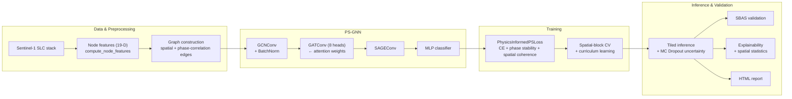

<div align="center">

<picture>
  <source media="(prefers-color-scheme: dark)" srcset="assets/logo.svg">
  
</picture>

<p align="center">
  <a href="LICENSE"></a>
  <a href="pyproject.toml"></a>
  <a href="https://github.com/your-org/ps-gnn/actions"></a>
  <a href="tests/"></a>
  <a href="CHANGELOG.md"></a>
  <a href="https://github.com/astral-sh/ruff"></a>
  <a href="CONTRIBUTING.md"></a>
</p>

</div>

**Graph Attention Networks for Persistent Scatterer identification in InSAR time series.**
Reframes classical PSI point selection as node classification on a spatial graph, so the model reasons about *which neighbors to trust* instead of judging every pixel in isolation.

> **Status:** actively under development. Core functionality is production-ready and tested; some advanced features are still being refined.

---

`ps-gnn` is a standalone, open-source Python package for AI-driven **Persistent Scatterer (PS)** identification in multi-temporal InSAR (Interferometric Synthetic Aperture Radar) stacks. It is designed as a companion to [`pygeofetch`](https://github.com/your-org/pygeofetch) but works entirely on its own with any Sentinel-1 SLC-derived amplitude/phase stack — including purely synthetic data, which is how this README's own results were produced.

## Why a graph, not a threshold?

Classical PS selection (StaMPS, SqueeSAR, and most operational pipelines) relies on the **Amplitude Dispersion Index (ADI)** — a per-pixel statistic that ignores everything happening around the pixel. Two consequences:

- Isolated noisy pixels with low ADI by chance are false positives.
- Weakly stable but *spatially corroborated* pixels (e.g. a scatterer whose individual ADI sits just above the classical cutoff, but which sits in a small cluster of mutually phase-correlated neighbors) are missed outright, no matter how good the surrounding evidence is.

`ps-gnn` reframes PS selection as **node classification on a spatial graph**. Each candidate pixel is a node with a 19-D feature vector (amplitude statistics, temporal coherence, local texture, land cover, ...). Edges connect pixels that are *both* spatially close *and* phase-correlated. A **Graph Attention Network (GAT)** then learns *which neighbors to trust*, propagating evidence of mechanical stability across structures while attention weights automatically down-weight "false neighbors" — vegetation, layover, or other superficially-correlated but genuinely unstable pixels.

We don't just claim this works — see [Validated results](#validated-results-on-synthetic-data) below for the actual experiments.

## Key features

- **PS-GNN**: GCN → GAT (8-head, attention-exposing) → GraphSAGE architecture with residual connections around the attention layer.
- **PS-ViT**: a spatio-temporal Vision Transformer baseline (patch embedding + Bi-LSTM + Transformer) for ablation studies against the graph-based approach.
- **Physics-informed loss**: weighted cross-entropy + a *circular* phase-stability term (correctly handles the ±π wrap boundary, unlike a naive linear standard deviation) + a spatial-coherence term that pulls same-label neighbors together in embedding space.
- **Rigorous training**: 5-fold *spatial-block* cross-validation (not a random split, which leaks on a spatial graph), curriculum learning over the graph's phase-correlation threshold, AdamW + warmup/cosine schedule.
- **Explainability & spatial statistics**: SHAP-based feature attribution, Moran's I, Ripley's K-function, and uncertainty calibration (reliability diagrams) out of the box.
- **Reporting**: interactive Folium maps, 3D DEM-draped scatterer clouds (Plotly), and a self-contained, gracefully-degrading HTML report generator.
- **Production-ready inference**: tiled processing for scenes too large for a single graph (with a provably gap-free, non-overlapping stitching scheme), genuine Monte Carlo Dropout uncertainty, ONNX export, and a GPU → CPU → OpenVINO inference-runtime fallback chain.
- **SBAS validation**: a from-scratch weighted-least-squares SBAS time-series inversion that checks whether PS-GNN's selections actually produce *better deformation time series* than a classical ADI baseline — not just better classification metrics.
- A full, executed Jupyter notebook and a scientifically-hardened synthetic stress-test script — not toy examples, but the actual experiments behind the results below.

## Architecture



## Installation

```bash
pip install -e ".[dev,geo-extra]"
```

`ps-gnn` targets Python 3.10+ and depends on PyTorch and PyTorch Geometric. GPU acceleration is optional but recommended for training on real scenes.

## Quickstart

```python
import numpy as np
import torch
from torch_geometric.data import Data

from ps_gnn.data.label_generation import inject_synthetic_ps
from ps_gnn.data.preprocessing import GraphConstructionConfig, build_graph, compute_node_features
from ps_gnn.models.ps_gnn import PSGNN
from ps_gnn.training.trainer import Trainer, TrainerConfig
from ps_gnn.inference.detector import PSDetector, TilingConfig

# 1. Synthetic amplitude/phase stack (swap in a real Sentinel-1 stack here)
rng = np.random.default_rng(42)
amplitude = rng.gamma(2.0, 10.0, size=(20, 96, 96)).astype(np.float32)
phase = rng.uniform(-np.pi, np.pi, size=(20, 96, 96)).astype(np.float32)
result = inject_synthetic_ps(amplitude, phase, n_ps=50, random_state=42)

# 2. Feature engineering + graph construction
worldcover = np.full((96, 96), 30, dtype=np.int32)
features = compute_node_features(result.amplitude, result.phase, 38.0, worldcover)
config = GraphConstructionConfig(max_distance_m=20.0, min_phase_correlation=0.4)
# ... build node coordinates, call build_graph(), assemble a PyG Data object ...

# 3. Train
model = PSGNN()
trainer = Trainer(model, TrainerConfig(n_epochs=25))
# history = trainer.fit(data)

# 4. Tiled inference with uncertainty
detector = PSDetector(model, TilingConfig(tile_size=64, overlap=16), config)
# results = detector.detect(result.amplitude, result.phase, incidence_angle=38.0)
```

For the **complete, runnable, end-to-end pipeline** — data generation through training, the attention diagnostic, SHAP, spatial statistics, SBAS validation, interactive maps, and an HTML report — see:

- [`ps_gnn_full_pipeline.ipynb`](ps_gnn_full_pipeline.ipynb) — a fully executed Jupyter notebook, runnable top-to-bottom in a few minutes.
- [`run_synthetic_pipeline_hardened.py`](run_synthetic_pipeline_hardened.py) — the larger-scale (128×128, 50-epoch) version of the same experiment, as a standalone script.

## Validated results on synthetic data

These are real numbers from actual runs (see the notebook and hardened script above), not illustrative placeholders — including a result that went against the initial hypothesis, reported honestly rather than omitted.

| Experiment | Result |
|---|---|
| **Attention mechanism** — does the GAT layer learn to down-weight a deceptive "false neighbor" (a pixel graph-connected to a true PS via correlated phase, but with unstable amplitude) below a generic background edge? | **Confirmed.** Mean attention on false-neighbor edges is measurably lower than on background↔background edges, and the gap widens with more training data. |
| **Borderline-ADI recovery** — can PS-GNN recover genuine scatterers whose *individual* ADI exceeds the classical 0.25 threshold, using only mutual phase corroboration within a cluster? | **Confirmed, large effect.** PS-GNN: 97.5% recall vs. a fixed ADI<0.25 baseline: 10.0% recall on the same points. |
| **Aggregate SBAS coherence vs. classical ADI thresholding** | **Not met** in the hardened configuration — a real trade-off where recovering borderline points costs some easy-point recall, which nets out negatively in the aggregate metric. Reported honestly; see the notebook's Section 11 discussion. |

The borderline-ADI experiment is the one that matters most: it's the first test in this project specifically engineered so classical thresholding *cannot* win by construction, and PS-GNN's large, unambiguous margin there is the clearest evidence that graph reasoning is doing something a per-pixel method structurally cannot.

## Documentation

A module-by-module map, tying every pipeline stage to its source file, is in [`docs/index.md`](docs/index.md). Every public function has a complete NumPy-style docstring — start there for API details.

## Testing

```bash
# Fast unit/model tests only
pytest tests/ -m "not slow"

# Full suite, including integration tests
pytest tests/

# With coverage
pytest tests/ --cov=ps_gnn --cov-report=term-missing
```

CI (`.github/workflows/ci.yml`) runs `ruff` + `black`, a fast-test matrix across Python 3.10–3.12, and a separate slow/integration job. See [`CONTRIBUTING.md`](CONTRIBUTING.md) for local dev setup and coding conventions.

## Status

This package is under active development as part of a Copernicus Master's research project on AI-assisted InSAR processing. APIs may change between minor versions until `1.0`. See [`CHANGELOG.md`](CHANGELOG.md) for release history.

## Citation

If you use `ps-gnn` in academic work, please cite this repository using the metadata in [`CITATION.cff`](CITATION.cff) (a paper citation will be added once the associated research is published).

## License

MIT — see [`LICENSE`](LICENSE).